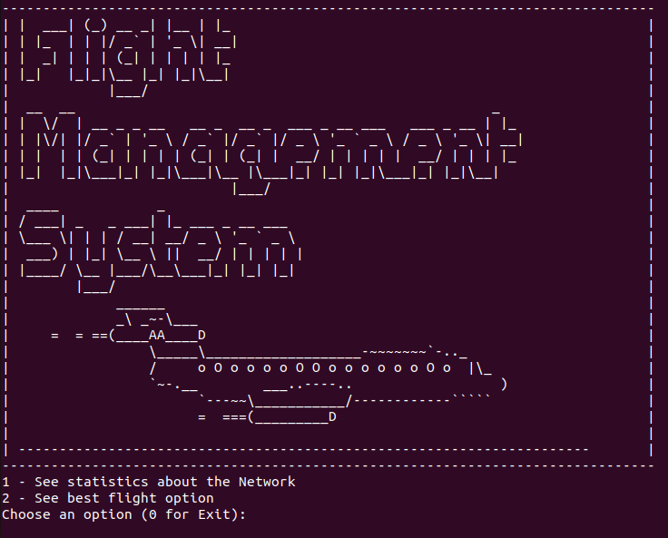

# Flight Management System (aed-flight)


## Table of contents
* [General Information](#general-information)
* [Technologies used](#technologies-used)
* [How to build](#how-to-build)
* [How to run](#how-to-run)
* [Notes](#notes)

## General Information
This project is focused on managing Flights and Airports
using different data structures and algorithms.

## Technologies used
Project is created with:
- C++: 11
- Doxygen: 1.9.1

## How to build

To build this project:
- Use Clion IDE to build the project **or**
- Manually build project into cmake-build-release folder:
```bash
cmake -DCMAKE_BUILD_TYPE=Release -S . -B build
cmake --build build/
```

## How to run

To run this project:

- Go to release-build directory and execute the program:
```bash
# via clion
cd cmake-build-release
./aed_flight

# build manually
cd build
./aed_flight
```

## Notes
Note that the project uses macros for clearing the screen, an execution in the command line would provide a better 
experience.
